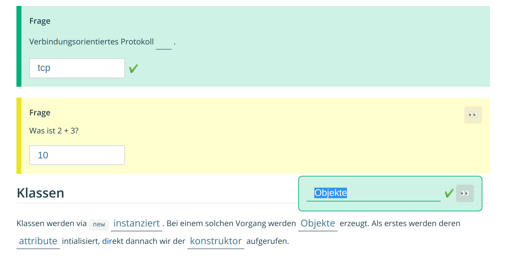

# vuepress-classroom

vuepress components for classroom setting

- Create Input Boxes for entering answers and revealing solution
- Create the same, however as inline input.

### Based on BackToTop example to register component

https://github.com/vuejs/vuepress/blob/master/packages/%40vuepress/plugin-back-to-top/package.json

## Development

1. `yarn link` here and `yarn link @nexuscomputing/vuepress-classroom` in the vuepress project.
2. Inject as plugin into `.vuepress/config.js`.
3. Use `yarn build` and `yarn dev --no-cache` (according to this [issue](https://github.com/vuejs/vuepress/issues/1580#issuecomment-489713715) )


Used vuepress as dependency since some dependencies seem to have been unmet without it (although this seems to work when not using `yarn link`).

## Components

```

::: question tcp
Verbindungsorientiertes Protokoll <Question answer="tcp" /> .
:::


<br>


::: question 5
Was ist 2 + 3?
:::

## Klassen

Klassen werden via `new` <Question answer="instanziert"/>. Bei einem solchen Vorgang werden <Question answer="Objekte"/> erzeugt. Als erstes werden deren <Question answer="attribute"/> intialisiert, direkt dannach wir der <Question answer="konstruktor"/> aufgerufen.

```

## Screen


